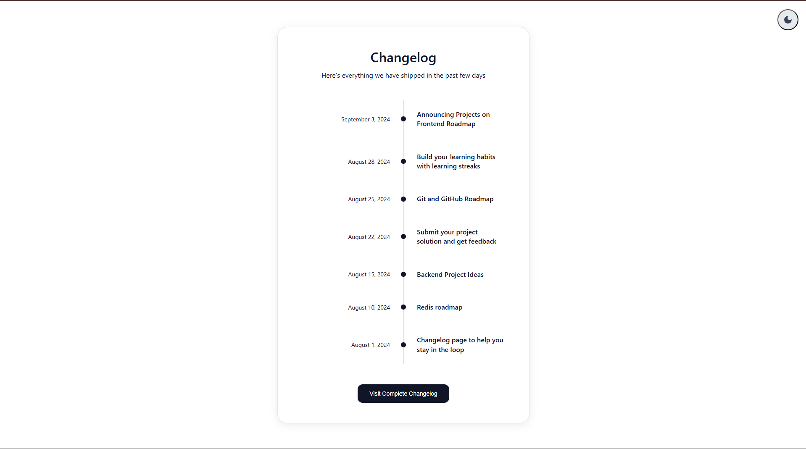
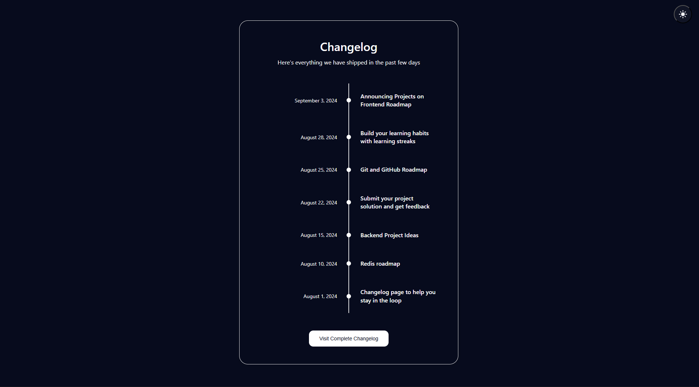

# Changelog Timeline

A modern, responsive changelog website built with vanilla HTML, CSS, and JavaScript featuring a clean timeline design and dark/light mode toggle.

## 🌟 Features

- **Timeline Design**: Clean, vertical timeline layout with visual dots and connecting lines
- **Responsive Layout**: Fully responsive design that works on all devices and screen sizes
- **Dark/Light Mode**: Toggle between dark and light themes with smooth transitions
- **Modern UI**: Clean, minimalist design with subtle shadows and rounded corners
- **Cross-browser Compatible**: Works seamlessly across all modern browsers
- **Accessibility Focused**: Semantic HTML structure with proper contrast ratios
- **Smooth Animations**: CSS transitions and hover effects for enhanced user experience


## 📸 Screenshots

### Light Mode


### Dark Mode


## 🛠️ Technologies Used

- **HTML5** - Semantic markup and structure
- **CSS3** - Styling, animations, and responsive design
- **JavaScript (ES6+)** - Dark/light mode functionality and interactions
- **CSS Grid & Flexbox** - Modern layout techniques

## 📂 Project Structure

```
changelog-project/
├── changelog.html          # Main HTML file
├── style.css          # CSS styles and responsive design
├── changelog.js          # JavaScript functionality
├── README.md          # Project documentation
└── screenshots/       # Project screenshots
    ├── light-mode.png
    └── dark-mode.png
```

## ⚡ Quick Start

1. **Clone the repository**
   ```bash
   git clone https://github.com/Amson-tECH/roadmap.sh-projects.git
   ```

2. **Navigate to project directory**
   ```bash
   cd frontend-projects/changelog
   ```

3. **Open in your browser**
   ```bash
   # Simply open changelog.html in your preferred browser
   # Or use a local server for development
   ```

### Using Live Server (Recommended)

If you're using VS Code, install the Live Server extension and:
1. Right-click on `changelog.html`
2. Select "Open with Live Server"
3. Your browser will open automatically with live reload functionality

## 🎨 Customization

### Adding New Changelog Entries

Edit the timeline items in `changelog.html`:

```html
<div class="timeline-item">
    <div class="timeline-date">Your Date Here</div>
    <div class="timeline-dot"></div>
    <div class="timeline-content">Your Update Description</div>
</div>
```

### Modifying Colors

Update CSS custom properties in `style.css`:

```css
:root {
    --base-color: white;
    --base-variant: #e8e9ed;
    --text-color: #111528;
    --secondary-text: #232738;
    --primary-color: #3a435d;
    --accent-color: #0071ff;
}
```

### Theme Toggle

The dark/light mode toggle is handled in `changelog.js`. The theme preference is stored in localStorage for persistence across sessions.

## 🌙 Dark Mode Implementation

The project includes a sophisticated dark/light mode system:

- **Theme Toggle Button**: Easy-to-use toggle switch
- **Local Storage**: Remembers user preference
- **System Preference Detection**: Respects user's OS theme preference
- **Smooth Transitions**: Animated theme switching
- **Consistent Colors**: Carefully chosen colors for both themes

## 📱 Responsive Design

The changelog is fully responsive with breakpoints for:
- **Desktop**: 1024px and above
- **Tablet**: 768px - 1023px  
- **Mobile**: 320px - 767px

## 🔧 Browser Support

- ✅ Chrome (latest)
- ✅ Firefox (latest)
- ✅ Safari (latest)
- ✅ Edge (latest)
- ✅ Mobile browsers

## 🤝 Contributing

Contributions are welcome! Please feel free to submit a Pull Request. For major changes:

1. Fork the repository
2. Create your feature branch (`git checkout -b feature/AmazingFeature`)
3. Commit your changes (`git commit -m 'Add some AmazingFeature'`)
4. Push to the branch (`git push origin feature/AmazingFeature`)
5. Open a Pull Request


## 👨‍💻 Author

**Reuben Korsi Amuzu**
- GitHub: [@Amson-tECH](https://github.com/Amson-tECH)
- LinkedIn: [Reuben Korsi Amuzu](in/reuben-korsi-amuzu-506265358)
- Email: reubenamuzu23@gmail.com

## 🙏 Acknowledgments

- Inspired by modern changelog designs from popular developer tools
- Icons and design patterns from contemporary web design trends
- Thanks to the open-source community for best practices and inspiration

## 📈 Future Enhancements

- [ ] Search functionality for changelog entries
- [ ] Filter by categories/tags
- [ ] RSS feed support
- [ ] Email subscription for updates
- [ ] Animated entry transitions
- [ ] Export changelog to PDF
- [ ] Admin panel for content management

---

⭐ **Star this repository if you found it helpful!**